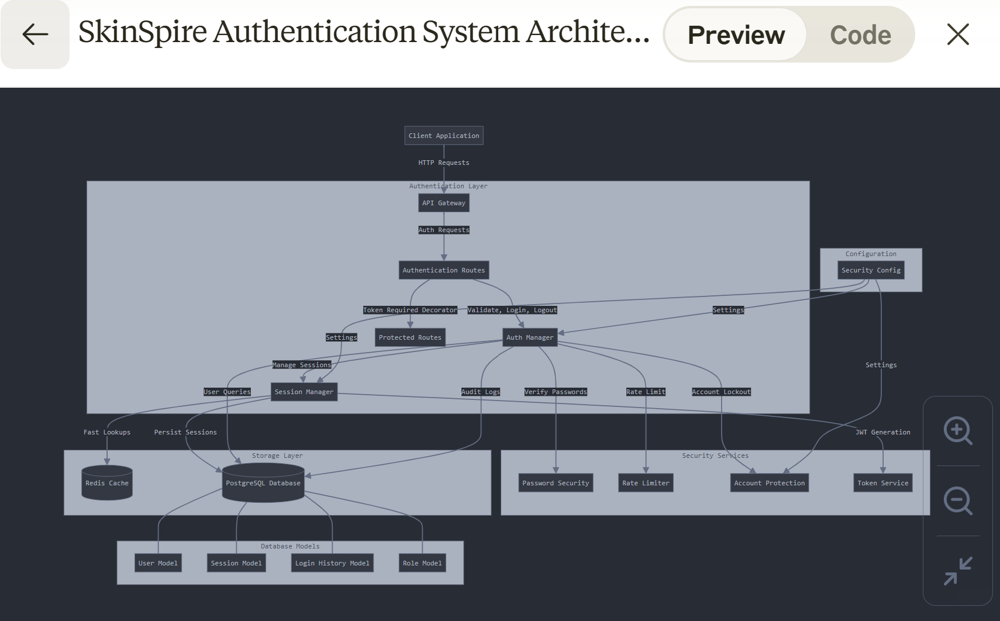
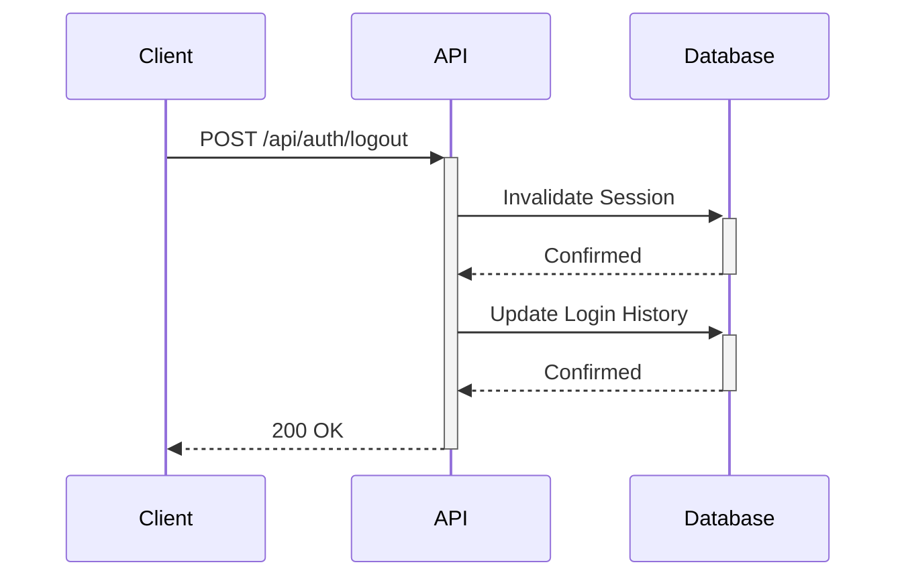

# SkinSpire Authentication System Documentation

## 1. Overview

The SkinSpire Clinic Authentication System provides secure user authentication and session management for the Hospital Management System. It is designed with security best practices, flexibility, and scalability in mind, supporting multi-tenant architecture with hospital-specific security configurations.

## 2. Architecture

The authentication system follows a modular architecture with these key components:


# SkinSpire Authentication System Architecture Diagram

## Explanation of Components

### Client Layer
- **Client Application**: Web or mobile application that users interact with
- **API Gateway**: Entry point for all API requests, handles routing and basic validation

### Authentication Layer
- **Authentication Routes**: REST API endpoints for login, logout, and token validation
- **Auth Manager**: Central controller for authentication logic and user verification
- **Session Manager**: Handles creation and validation of user sessions
- **Protected Routes**: Routes that require authentication via token

### Security Services
- **Password Security**: Handles secure password hashing and verification
- **Rate Limiter**: Prevents brute force attacks by limiting login attempts
- **Account Protection**: Manages account lockout after failed login attempts
- **Token Service**: Generates and validates JWT tokens

### Storage Layer
- **Redis Cache**: Optional high-performance cache for session data
- **PostgreSQL Database**: Persistent storage for user accounts and authentication data

### Database Models
- **User Model**: Stores user credentials and account status
- **Session Model**: Tracks active user sessions
- **Login History Model**: Records all authentication attempts
- **Role Model**: Stores user roles for authorization

### Configuration
- **Security Config**: Centralized settings for all security components

This architecture provides a comprehensive authentication system with multiple layers of security, performance optimization through caching, and complete audit trail capabilities.



### 2.1 Core Components

- **AuthManager**: Central controller for authentication logic
- **SessionManager**: Manages user sessions with dual storage (Database/Redis)
- **Authentication Routes**: REST API endpoints for auth operations
- **Security Models**: Database entities for users, sessions, and audit logs

### 2.2 Technology Stack

- **Backend Framework**: Flask 3.1.0
- **Database ORM**: SQLAlchemy 2.0.36
- **Token Generation**: JWT (JSON Web Tokens)
- **Password Handling**: Werkzeug security
- **Session Cache**: Redis (optional)

## 3. Authentication Flows

### 3.1 Login Flow

```mermaid
sequenceDiagram
    Client->>+API: POST /api/auth/login
    Note right of API: Check username & password
    API->>+Database: Query User
    Database-->>-API: Return User
    alt Invalid Credentials
        API->>+Database: Log failed attempt
        Database-->>-API: Confirmed
        API-->>-Client: 401 Unauthorized
    else Valid Credentials
        API->>+Database: Create Session
        Database-->>-API: Session Created
        API->>+Database: Log successful login
        Database-->>-API: Confirmed
        API-->>-Client: 200 OK + auth token
    end
```

### 3.2 Session Validation Flow

```mermaid
sequenceDiagram
    Client->>+API: Request with auth token
    API->>+Database: Validate Session
    Database-->>-API: Session Status
    alt Invalid/Expired Session
        API-->>-Client: 401 Unauthorized
    else Valid Session
        API->>API: Process Request
        API-->>-Client: 200 OK + Response
    end
```

### 3.3 Logout Flow


### 3.4 Web Authentication Flow

The SkinSpire Clinic system implements a specialized authentication flow for web-based login and registration that offers enhanced security and performance while maintaining all protection mechanisms:

```mermaid
sequenceDiagram
    Client->>+Web Route: POST /login or /register with CSRF token
    Web Route->>+Web Route: Validate CSRF token (WTForms)
    Note right of Web Route: Direct database authentication
    Web Route->>+Database Service: Database session request
    Database Service->>+Database: Query/update user data
    Database-->>-Database Service: User data
    Database Service-->>-Web Route: User object
    Web Route->>Web Route: Generate JWT token
    Web Route->>Web Route: Initialize Flask-Login session
    Web Route-->>-Client: Redirect to dashboard
...

This direct database access pattern for authentication routes:

Maintains CSRF protection through WTForms validation
Eliminates redundant API calls within the same application
Preserves all security controls and audit logging
Improves performance by reducing request overhead

The pattern is specifically optimized for the critical authentication operations while maintaining centralized database access through the database service.
...

## 4. API Endpoints

### 4.1 Authentication Endpoints

| Endpoint | Method | Description | Request Body | Response |
|----------|--------|-------------|--------------|----------|
| `/api/auth/login` | POST | Authenticate user | `{"username": string, "password": string}` | `{"token": string, "user": object}` |
| `/api/auth/logout` | POST | End user session | None (Token in header) | `{"message": string}` |
| `/api/auth/validate` | GET | Validate token | None (Token in header) | `{"valid": bool, "user": object}` |
| `/api/auth/status` | GET | Service health check | None | `{"status": string}` |

### 4.2 Authentication Headers

```
Authorization: Bearer <token>
```

## 5. Security Features

### 5.1 Password Security

- Secure password hashing using Werkzeug's `generate_password_hash`
- Configurable password policies including:
  - Minimum length
  - Complexity requirements
  - Password expiration
  - Password history

### 5.2 Account Protection

- **Account Lockout**: Automatically locks accounts after multiple failed login attempts
- **Rate Limiting**: Prevents brute force attacks by limiting login attempts
- **Session Timeout**: Automatically expires sessions after configurable periods

### 5.3 Audit Trail

- Comprehensive logging of authentication events:
  - Login attempts (successful/failed)
  - Session creation and termination
  - IP addresses and user agents
  - Detailed failure reasons

### 5.4 Multi-tier Storage

- **Primary Storage**: PostgreSQL database for persistent auth data
- **Cache Layer**: Optional Redis integration for high-performance session validation

## 6. Database Schema

### 6.1 Authentication Tables

#### User Table

```
users
├── user_id (PK): String - User identifier (phone number)
├── hospital_id (FK): UUID - Associated hospital
├── entity_type: String - 'staff' or 'patient'
├── entity_id: UUID - Staff or patient record ID
├── password_hash: String - Hashed password
├── failed_login_attempts: Integer - Count of failed attempts
├── last_login: DateTime - Last successful login
└── is_active: Boolean - Account status
```

#### UserSession Table

```
user_sessions
├── session_id (PK): UUID - Unique session identifier
├── user_id (FK): String - Associated user
├── token: String - Authentication token
├── created_at: DateTime - Session creation time
├── expires_at: DateTime - Session expiration time
└── is_active: Boolean - Session status
```

#### LoginHistory Table

```
login_history
├── history_id (PK): UUID - Log entry identifier
├── user_id (FK): String - User who attempted login
├── login_time: DateTime - When attempt occurred
├── logout_time: DateTime - Optional, when session ended
├── ip_address: String - Client IP address
├── user_agent: String - Client browser/app info
├── status: String - 'success' or 'failed'
└── failure_reason: String - Optional error details
```

## 7. Integration Guide

### 7.1 Authenticating Requests

```python
# Make login request
response = requests.post(
    'https://api.skinspire.com/api/auth/login',
    json={'username': 'user_phone', 'password': 'secure_password'}
)
token = response.json()['token']

# Use token for authenticated requests
response = requests.get(
    'https://api.skinspire.com/api/protected-endpoint',
    headers={'Authorization': f'Bearer {token}'}
)
```

### 7.2 Securing Routes

```python
from app.security.routes.auth import token_required

@app.route('/api/protected-endpoint', methods=['GET'])
@token_required
def protected_endpoint(current_user):
    # current_user is automatically injected
    return jsonify({'data': 'Protected data'})
```

## 8. Testing Strategy

The authentication system includes comprehensive testing:

- **Unit Tests**: Test individual components (AuthManager, SessionManager)
- **Integration Tests**: Test interactions between components
- **API Tests**: Test authentication endpoints
- **Security Tests**: Specific tests for security features (lockout, rate limiting)

Test cases cover:
- Basic login functionality
- Failed login handling
- Account lockout
- Session management
- Token validation
- Logout functionality
- Input validation

## 9. Configuration

Key configuration parameters are managed through the SecurityConfig class:

| Setting | Description | Default |
|---------|-------------|---------|
| `session_timeout` | Session duration before expiry | 12 hours |
| `max_login_attempts` | Failed attempts before lockout | 5 |
| `lockout_duration` | Duration of account lockout | 30 minutes |
| `rate_limit_window` | Time window for rate limiting | 60 seconds |
| `login_rate_limit` | Maximum login attempts per window | 5 |

## 10. Security Considerations

- Token transmissions should be over HTTPS only
- Sensitive logs should be properly secured
- Redis cache (if used) should be properly secured
- Regular security audits are recommended
- Account lockout notifications should be implemented

## 11. Performance Optimizations

- **Redis Integration**: Optional Redis support for high-performance session management
- **JWT Tokens**: Lightweight tokens with minimal database lookups
- **Connection Pooling**: Database connection pooling for efficient resource usage
- **Caching**: Session caching to reduce database load

---

This documentation provides a comprehensive overview of the SkinSpire Authentication System. For specific implementation details, refer to the accompanying source code and inline documentation.