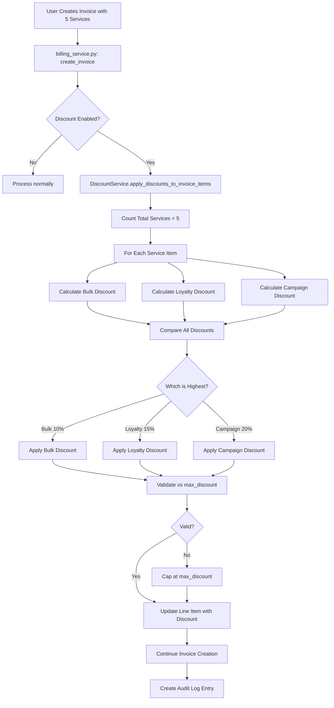

# Bulk Service Discount Implementation Summary
**Date:** November 20, 2025
**Status:** Core Backend Complete ✅ | Frontend & Admin UI Pending ⏳

---

## 📋 Executive Summary

Successfully implemented a **simplified, hospital-policy-driven bulk service discount system** with loyalty card integration and audit trail. The system automatically calculates and applies the best available discount (bulk, loyalty, or campaign) to service items during invoice creation.

### Key Design Decision
Instead of complex rule tables, we use:
- **Hospital table**: Sets the bulk discount threshold (e.g., "5 services trigger discount")
- **Service table**: Each service defines its own bulk discount percentage (e.g., "Laser: 10%, Medifacial: 15%")
- **Loyalty card types**: Define tier-based discounts (Silver: 5%, Gold: 10%, Platinum: 15%)
- **Automatic best-discount selection**: System compares all applicable discounts and applies the highest one

---

## ✅ Completed Implementation

### 1. Database Schema (Migration File)
**File:** `migrations/20251120_create_bulk_discount_system.sql`

#### Changes Made:

**A. Hospital Table (3 new columns):**
```sql
ALTER TABLE hospitals
ADD COLUMN bulk_discount_enabled BOOLEAN DEFAULT FALSE,
ADD COLUMN bulk_discount_min_service_count INTEGER DEFAULT 5,
ADD COLUMN bulk_discount_effective_from DATE;
```

**B. Service Table (1 new column):**
```sql
ALTER TABLE services
ADD COLUMN bulk_discount_percent NUMERIC(5, 2) DEFAULT 0;
```

**C. New Tables Created:**
1. **`loyalty_card_types`** - Defines card tiers (Silver, Gold, Platinum) with discount percentages
2. **`patient_loyalty_cards`** - Links patients to their loyalty cards
3. **`discount_application_log`** - Complete audit trail of all discount applications

**Sample Data Included:**
- 4 loyalty card types (Standard, Silver, Gold, Platinum) with escalating discounts
- Bulk discount enabled for all hospitals by default

---

### 2. Data Models
**File:** `app/models/master.py`

**Added 3 New Model Classes:**

```python
class Hospital:
    # New fields
    bulk_discount_enabled = Column(Boolean, default=False)
    bulk_discount_min_service_count = Column(Integer, default=5)
    bulk_discount_effective_from = Column(Date)

class Service:
    # New field
    bulk_discount_percent = Column(Numeric(5, 2), default=0)

class LoyaltyCardType(Base, TimestampMixin, TenantMixin, SoftDeleteMixin):
    """Defines loyalty card tiers with associated discounts"""
    card_type_id, hospital_id, card_type_code, card_type_name, description
    discount_percent, benefits, min_lifetime_spend, min_visits
    card_color, icon_url, display_sequence, is_active

class PatientLoyaltyCard(Base, TimestampMixin, TenantMixin, SoftDeleteMixin):
    """Links patients to loyalty cards"""
    patient_card_id, patient_id, card_type_id
    card_number, issue_date, expiry_date, is_active

class DiscountApplicationLog(Base):
    """Audit trail for discounts"""
    log_id, invoice_id, line_item_id, service_id, patient_id
    discount_type, discount_percent, discount_amount
    original_price, final_price, calculation_metadata
```

---

### 3. Discount Calculation Service
**File:** `app/services/discount_service.py`

**Core Functions Implemented:**

#### A. `calculate_bulk_discount()`
- Checks if hospital has bulk discount enabled
- Verifies total service count meets minimum threshold
- Retrieves service-specific bulk discount percentage
- Returns discount calculation result

#### B. `calculate_loyalty_discount()`
- Queries patient's active loyalty card
- Gets discount percentage from card type
- Validates card expiry date
- Returns discount calculation result

#### C. `calculate_campaign_discount()`
- Placeholder for future campaign hook integration
- Designed to work with existing `CampaignHookConfig` system
- Returns None for now (implement when campaign hooks ready)

#### D. `get_best_discount()` ⭐ **Main Function**
- Calls all discount calculators
- Compares discount percentages
- Selects and returns the highest discount
- Adds metadata about competing discounts

#### E. `validate_discount()`
- Checks proposed discount against `Service.max_discount`
- Returns validation result with error message if exceeded

#### F. `apply_discounts_to_invoice_items()` ⭐ **Integration Point**
- Counts total services in invoice
- Applies best discount to each service item
- Validates against max_discount limits
- Updates line items with discount data
- **This is the function called from billing_service.py**

#### G. `log_discount_application()`
- Creates audit log entry for discount
- Stores all calculation metadata
- Links to invoice, line item, patient, service

#### H. `get_discount_summary()`
- Generates discount reports by date range
- Breaks down by discount type
- Calculates total discount amounts and percentages

---

### 4. Billing Service Integration
**File:** `app/services/billing_service.py`

**Changes Made:**

1. **Import Added (Line 49):**
   ```python
   from app.services.discount_service import DiscountService
   ```

2. **Discount Calculation Injection (Lines 844-881):**
   - Added automatic discount application before line items are processed
   - Wrapped in try-except to prevent invoice creation failure if discount calculation errors
   - Comprehensive logging of discount application results
   - Applies discounts to service items only (not medicines/products)

**Integration Flow:**
```
Invoice Creation Request
  ↓
Apply Automatic Discounts  ← NEW STEP
  ├─ Count total services
  ├─ For each service:
  │   ├─ Calculate bulk discount
  │   ├─ Calculate loyalty discount
  │   ├─ Calculate campaign discount
  │   ├─ Select best discount
  │   └─ Validate against max_discount
  ↓
Process Line Items (existing logic)
  ↓
Create Invoice Header
  ↓
Create Invoice Line Items
  ↓
GL Entries / Inventory Update (existing logic)
```

---

## ⏳ Pending Implementation

### 1. Run Database Migration ⚠️ **PRIORITY**
```bash
# Connect to PostgreSQL
psql -U your_username -d skinspire_db

# Run migration
\i migrations/20251120_create_bulk_discount_system.sql

# Verify tables created
\dt loyalty_card_types
\dt patient_loyalty_cards
\dt discount_application_log

# Verify columns added
\d hospitals
\d services
```

---

### 2. Frontend - Invoice Creation Page

#### A. Add Discount Indicator Badges
**File:** `app/templates/billing/create_invoice.html`

**Required Changes:**
- Add discount type badge next to discount percentage field
- Show visual indicator (color-coded):
  - 🔵 Blue = Bulk Discount
  - 🟡 Gold = Loyalty Discount
  - 🟢 Green = Campaign Discount
  - ⚪ Gray = Manual Discount

**Example UI:**
```html
<div class="discount-info">
    <input type="number" class="discount-percent" value="10.00" />
    <span class="discount-badge bulk-discount">Bulk 10%</span>
    <small class="discount-reason">5 services in invoice</small>
</div>
```

#### B. Auto-Recalculate on Item Changes
**File:** `app/static/js/pages/invoice.js`

**Required Logic:**
```javascript
// When user adds/removes service items
function onLineItemChange() {
    const serviceCount = countServiceItems();
    if (serviceCount >= bulkDiscountThreshold) {
        // Show notification: "Bulk discount available!"
        highlightDiscountOpportunity();
    }
    // Optionally: make API call to recalculate discounts
    // GET /api/calculate_discounts?patient_id=X&service_ids=[...]
}
```

---

### 3. Admin UI - Discount Configuration

#### A. Loyalty Card Types Management
**File:** `app/config/modules/loyalty_card_type_config.py` (NEW)

**Required:**
- Universal Engine configuration for loyalty_card_types table
- CRUD operations for card type management
- Fields: code, name, discount %, min spend, min visits, card color

**Example Configuration:**
```python
from app.config.core_definitions import EntityConfig, FieldDefinition, FieldType

loyalty_card_type_config = EntityConfig(
    entity_name='loyalty_card_types',
    display_name='Loyalty Card Types',
    primary_key='card_type_id',
    fields=[
        FieldDefinition(name='card_type_code', label='Card Code', field_type=FieldType.TEXT, required=True),
        FieldDefinition(name='card_type_name', label='Card Name', field_type=FieldType.TEXT, required=True),
        FieldDefinition(name='discount_percent', label='Discount %', field_type=FieldType.NUMBER, required=True),
        FieldDefinition(name='min_lifetime_spend', label='Min Lifetime Spend', field_type=FieldType.NUMBER),
        FieldDefinition(name='card_color', label='Card Color', field_type=FieldType.COLOR),
        FieldDefinition(name='is_active', label='Active', field_type=FieldType.BOOLEAN),
    ],
    ...
)
```

#### B. Hospital Bulk Discount Settings
**File:** `app/config/modules/hospital_config.py` (MODIFY)

**Required:**
- Add bulk discount fields to hospital edit form:
  - ✅ Enable Bulk Discount (checkbox)
  - 🔢 Minimum Service Count (number input, default: 5)
  - 📅 Effective From Date (date picker)

**Example Addition:**
```python
# In hospital_config.py, add to fields list:
FieldDefinition(
    name='bulk_discount_enabled',
    label='Enable Bulk Service Discount',
    field_type=FieldType.BOOLEAN,
    help_text='Automatically apply discount when multiple services are invoiced together'
),
FieldDefinition(
    name='bulk_discount_min_service_count',
    label='Minimum Service Count for Bulk Discount',
    field_type=FieldType.NUMBER,
    help_text='Number of services required to trigger bulk discount (e.g., 5)',
    conditional_display={'field': 'bulk_discount_enabled', 'value': True}
),
```

#### C. Service Bulk Discount Configuration
**File:** `app/config/modules/service_config.py` (MODIFY)

**Required:**
- Add `bulk_discount_percent` field to service edit form
- Display next to `max_discount` field
- Validation: bulk_discount_percent ≤ max_discount

**Example Addition:**
```python
# In service_config.py, add to fields list:
FieldDefinition(
    name='bulk_discount_percent',
    label='Bulk Purchase Discount %',
    field_type=FieldType.NUMBER,
    help_text='Discount percentage when service is part of bulk purchase (e.g., 10.00 for 10%)',
    validation_rules={'max': 100, 'min': 0}
),
```

---

### 4. Patient Loyalty Card Assignment

#### A. Create Patient Loyalty Card Config
**File:** `app/config/modules/patient_loyalty_card_config.py` (NEW)

**Required:**
- Universal Engine configuration for patient_loyalty_cards table
- Link to patient and card type via dropdowns
- Fields: patient, card_type, card_number, issue_date, expiry_date

#### B. Add to Patient Profile Page
- Show patient's current loyalty card (if any)
- Button to "Assign Loyalty Card"
- Display card benefits and discount percentage

---

### 5. Reporting & Analytics

#### A. Discount Summary Report
**Endpoint:** `/api/reports/discount_summary`

**Features:**
- Date range filter
- Discount type breakdown
- Total discount amount vs revenue
- Top services with highest discount usage
- Patient loyalty card utilization

#### B. Discount Application Log Viewer
**Page:** `/reports/discount_log`

**Features:**
- Searchable table of all discount applications
- Filters: date range, discount type, patient, service
- Export to Excel/PDF
- Drill-down to invoice details

---

## 🧪 Testing Checklist

### Unit Tests
- [ ] `DiscountService.calculate_bulk_discount()` with various service counts
- [ ] `DiscountService.calculate_loyalty_discount()` with different card types
- [ ] `DiscountService.get_best_discount()` with competing discounts
- [ ] `DiscountService.validate_discount()` against max_discount limits

### Integration Tests
- [ ] Create invoice with 4 services (below threshold) → No bulk discount
- [ ] Create invoice with 5 services (at threshold) → Bulk discount applied
- [ ] Create invoice for patient with Gold card → Loyalty discount applied
- [ ] Bulk discount (10%) vs Loyalty discount (15%) → Loyalty wins
- [ ] Discount exceeds service max_discount → Capped at max_discount

### End-to-End Tests
- [ ] Admin creates loyalty card type
- [ ] Admin assigns loyalty card to patient
- [ ] User creates invoice for that patient with 5 services
- [ ] System auto-applies correct discount
- [ ] Discount appears in invoice line items
- [ ] Audit log created with metadata
- [ ] Invoice totals calculated correctly

---

## 📊 Database Schema Diagram

```
hospitals
├─ hospital_id (PK)
├─ bulk_discount_enabled ← NEW
├─ bulk_discount_min_service_count ← NEW
└─ bulk_discount_effective_from ← NEW

services
├─ service_id (PK)
├─ max_discount (existing)
└─ bulk_discount_percent ← NEW

loyalty_card_types ← NEW TABLE
├─ card_type_id (PK)
├─ hospital_id (FK → hospitals)
├─ card_type_code (e.g., 'GOLD')
├─ discount_percent (e.g., 10.00)
└─ min_lifetime_spend

patient_loyalty_cards ← NEW TABLE
├─ patient_card_id (PK)
├─ patient_id (FK → patients)
├─ card_type_id (FK → loyalty_card_types)
├─ card_number
├─ issue_date
├─ expiry_date
└─ is_active

discount_application_log ← NEW TABLE
├─ log_id (PK)
├─ invoice_id (FK → invoice_headers)
├─ line_item_id (FK → invoice_line_items)
├─ discount_type ('bulk', 'loyalty', 'campaign', 'manual')
├─ discount_percent
├─ discount_amount
├─ calculation_metadata (JSONB)
└─ service_count_in_invoice
```

---

## 🔄 Discount Calculation Flow



---

## 📝 API Reference

### Calculate Discounts for Line Items
```python
DiscountService.apply_discounts_to_invoice_items(
    session: Session,
    hospital_id: str,
    patient_id: str,
    line_items: List[Dict],
    invoice_date: date = None,
    respect_max_discount: bool = True
) -> List[Dict]
```

**Returns updated line_items with:**
```json
{
  "item_type": "Service",
  "item_id": "uuid",
  "item_name": "Laser Hair Reduction",
  "unit_price": 5000.00,
  "quantity": 1,
  "discount_percent": 10.00,  ← Added
  "discount_amount": 500.00,  ← Added
  "discount_type": "bulk",    ← Added
  "discount_metadata": {      ← Added
    "service_count": 5,
    "min_threshold": 5,
    "competing_discounts": [
      {"type": "loyalty", "percent": 5.0}
    ],
    "selection_reason": "Highest discount percentage"
  }
}
```

### Get Discount Summary Report
```python
DiscountService.get_discount_summary(
    session: Session,
    hospital_id: str,
    start_date: date,
    end_date: date,
    discount_type: str = None
) -> Dict
```

**Returns:**
```json
{
  "period": {"start_date": "2025-11-01", "end_date": "2025-11-30"},
  "total_discount_applications": 150,
  "total_discount_amount": 75000.00,
  "total_original_amount": 500000.00,
  "discount_percentage_overall": 15.0,
  "by_discount_type": {
    "bulk": {
      "count": 100,
      "total_discount": 50000.00,
      "avg_discount_percent": 10.0
    },
    "loyalty": {
      "count": 50,
      "total_discount": 25000.00,
      "avg_discount_percent": 12.5
    }
  }
}
```

---

## 🚀 Deployment Steps

### 1. Database Migration
```bash
# Backup database first!
pg_dump skinspire_db > backup_$(date +%Y%m%d).sql

# Run migration
psql -U postgres -d skinspire_db -f migrations/20251120_create_bulk_discount_system.sql

# Verify
psql -U postgres -d skinspire_db -c "\d loyalty_card_types"
psql -U postgres -d skinspire_db -c "\d+ hospitals" | grep bulk_discount
psql -U postgres -d skinspire_db -c "\d+ services" | grep bulk_discount_percent
```

### 2. Restart Application
```bash
# Reload Python app to pick up new models
sudo systemctl restart skinspire_app

# Or if using gunicorn
sudo systemctl restart gunicorn
```

### 3. Initial Configuration
- [ ] Login to admin panel
- [ ] Navigate to Hospital settings
- [ ] Enable bulk discount
- [ ] Set minimum service count (default: 5)
- [ ] Set effective from date (today)
- [ ] Navigate to Services
- [ ] Set bulk_discount_percent for each service (e.g., Laser: 10%, Medifacial: 15%)
- [ ] Verify loyalty card types were created (Standard, Silver, Gold, Platinum)

### 4. Test
- [ ] Create test patient
- [ ] Assign Gold loyalty card (10% discount)
- [ ] Create invoice with 5 services
- [ ] Verify bulk discount (e.g., 15% for specific service) is applied instead of loyalty (10%)
- [ ] Check discount_application_log table for audit entry

---

## 🎯 Success Criteria

✅ **Backend Complete:**
- [x] Database migration file created
- [x] Models added to master.py
- [x] DiscountService implemented with all calculation logic
- [x] Integrated into billing_service.py
- [x] Audit logging functional

⏳ **Pending (Frontend & Admin):**
- [ ] Migration executed on database
- [ ] Discount indicators on invoice UI
- [ ] Hospital admin can configure bulk discount policy
- [ ] Admin can manage loyalty card types
- [ ] Admin can assign loyalty cards to patients
- [ ] Service admin can set bulk discount percentages
- [ ] Discount reports accessible

---

## 📞 Support & Questions

For implementation questions or issues:
1. Check discount_application_log for audit trail
2. Review application logs for discount calculation debugging
3. Verify hospital.bulk_discount_enabled = TRUE
4. Verify service.bulk_discount_percent > 0
5. Check patient has active loyalty card if expecting loyalty discount

---

**Implementation Status:** 🟢 Core Backend Complete | 🟡 Frontend Pending
**Next Steps:** Run database migration, then implement frontend UI
