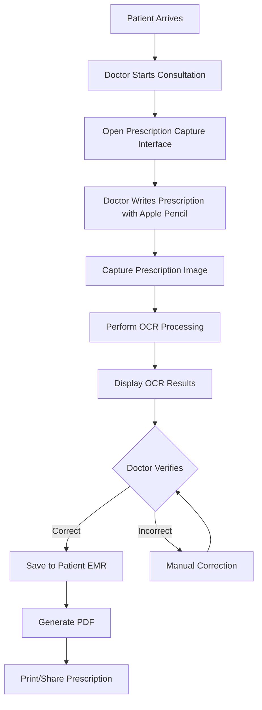

# Comprehensive Prescription Digitization Solution for SkinSpire Clinic

## Executive Summary
This comprehensive technical specification outlines a holistic approach to digitizing medical prescriptions for SkinSpire Clinic, combining business strategy with advanced technological implementation.

## Business Context and Strategic Vision

### The Challenge of Prescription Management
In the rapidly evolving healthcare landscape, SkinSpire Clinic faces critical challenges in prescription management:
- Inefficient paper-based prescription systems
- High risk of medical errors
- Limited patient record accessibility
- Challenging compliance with digital health standards

### Strategic Objectives
Our prescription digitization strategy aims to:
1. Improve patient care quality
2. Enhance operational efficiency
3. Reduce medical documentation errors
4. Enable seamless medical record integration
5. Position SkinSpire Clinic as a technology-forward healthcare provider

## System Architecture

### Hardware Configuration
- **Primary Device**: iPad Pro with Apple Pencil
- **Operating System**: iPadOS
- **Capture Method**: Native drawing interface with image export

### Software Components
- **Frontend**: HTML5/JavaScript Canvas
- **Backend**: Python Flask 3.1.0
- **OCR Engine**: Tesseract OCR (initially)
- **PDF Generation**: ReportLab
- **Integration**: Hospital Management System (HMS)

## Workflow Diagram


## OCR Accuracy Landscape

### Accuracy Rates Comparison
| OCR Solution | Medical Prescription Accuracy | Characteristics |
|--------------|-------------------------------|----------------|
| Tesseract (Untrained) | 60-70% | Not suitable for medical use |
| Tesseract (Custom Trained) | 80-85% | Requires significant training |
| Google Vision AI | 92-98% | Commercial solution |
| Amazon Textract | 90-95% | Healthcare-focused |
| ABBYY FlexiCapture | 93-97% | Medical-specific solution |

## Comprehensive Prescription Digitization Roadmap

### Short-Term Recommendations (0-6 Months)
#### Business Perspective
- Implement a foundational digital prescription capture system
- Minimize disruption to existing workflows
- Achieve immediate efficiency gains
- Develop staff comfort with new technology

#### Technical Implementation
1. Tesseract OCR Custom Training
```python
class ShortTermOCRStrategy:
    def initial_setup(self):
        """
        Initial prescription digitization setup
        - Minimal viable product approach
        - Focus on core functionality
        """
        return {
            'ocr_solution': 'Custom Tesseract',
            'accuracy_target': '80-85%',
            'manual_correction_required': True,
            'integration_complexity': 'Low'
        }
}
```

## Two-Way Integration Architecture

### Integration Mechanisms
```python
class DeviceRegistrationService:
    @staticmethod
    def register_device(doctor_id, device_info):
        """
        Register and validate a new medical device
        
        Args:
            doctor_id (UUID): Doctor's unique identifier
            device_info (dict): Device registration details
        
        Returns:
            Device registration object
        """
        device = MedicalDevice(
            doctor_id=doctor_id,
            device_uuid=device_info['uuid'],
            device_name=device_info['name'],
            device_type='iPad',
            registration_date=datetime.now(),
            status='active'
        )
        
        # Generate unique device token
        device.access_token = generate_secure_token()
        
        db.session.add(device)
        db.session.commit()
        
        return device
```

## Frontend Capture Interface
```html
<!DOCTYPE html>
<html>
<head>
    <title>Prescription Capture</title>
    <link href="https://cdn.tailwindcss.com/2.2.19/tailwind.min.css" rel="stylesheet">
</head>
<body class="bg-gray-100">
    <div class="container mx-auto p-4">
        <div class="bg-white shadow-md rounded-lg">
            <canvas 
                id="prescriptionCanvas" 
                class="border-2 border-gray-300 w-full"
                width="1024" 
                height="768"
            ></canvas>

            <div class="p-4 flex justify-between">
                <button 
                    id="clearCanvas" 
                    class="bg-red-500 text-white px-4 py-2 rounded"
                >
                    Clear
                </button>
                <button 
                    id="submitPrescription" 
                    class="bg-green-500 text-white px-4 py-2 rounded"
                >
                    Submit Prescription
                </button>
            </div>
        </div>
    </div>
</body>
</html>
```

## Backend OCR Processing
```python
class PrescriptionOCRService:
    @staticmethod
    def preprocess_image(image_data):
        """
        Preprocess image for improved OCR accuracy
        
        Args:
            image_data (str): Base64 encoded image
        
        Returns:
            numpy.ndarray: Preprocessed image
        """
        # Advanced image preprocessing techniques
        image_bytes = base64.b64decode(image_data.split(',')[1])
        nparr = np.frombuffer(image_bytes, np.uint8)
        image = cv2.imdecode(nparr, cv2.IMREAD_COLOR)
        
        # Grayscale conversion
        gray = cv2.cvtColor(image, cv2.COLOR_BGR2GRAY)
        
        # Noise reduction and thresholding
        gray = cv2.threshold(gray, 0, 255, 
            cv2.THRESH_BINARY | cv2.THRESH_OTSU
        )[1]
        
        return gray

    @staticmethod
    def perform_ocr(image_data):
        """
        Perform OCR on preprocessed image
        
        Returns:
            dict: OCR results with text and confidence
        """
        try:
            preprocessed_image = PrescriptionOCRService.preprocess_image(image_data)
            
            # Tesseract OCR processing
            text = pytesseract.image_to_string(preprocessed_image)
            
            # Calculate confidence
            confidence_data = pytesseract.image_to_data(
                preprocessed_image, 
                output_type=pytesseract.Output.DICT
            )
            
            return {
                'text': text,
                'confidence': np.mean(confidence_data['conf']) if len(confidence_data['conf']) > 0 else 0
            }
        
        except Exception as e:
            return {
                'error': str(e),
                'text': '',
                'confidence': 0
            }
```

## Medium-Term Recommendations (6-18 Months)
#### Business Perspective
- Expand digital prescription capabilities
- Improve accuracy and reliability
- Develop more sophisticated error handling
- Begin integration with broader healthcare ecosystem

#### Technical Enhancement
1. Hybrid OCR Solution
```python
class MediumTermOCRStrategy:
    def advanced_preprocessing(self, prescription_image):
        """
        Advanced image preprocessing for improved OCR
        """
        return {
            'preprocessing_steps': [
                'Noise reduction',
                'Contrast enhancement',
                'Handwriting style normalization'
            ],
            'expected_accuracy_improvement': '5-10%'
        }
}
```

## Long-Term Recommendations (18-36 Months)
#### Technical Transformation
1. AI-Powered Healthcare OCR
```python
class LongTermOCRStrategy:
    def ai_healthcare_integration(self):
        """
        Advanced AI-powered prescription management
        """
        return {
            'ai_capabilities': [
                'Near-perfect OCR accuracy',
                'Predictive medication insights',
                'Real-time error prevention'
            ],
            'integration_complexity': 'High',
            'potential_benefits': [
                'Reduced medical errors',
                'Enhanced patient care',
                'Strategic healthcare insights'
            ]
        }
}
```

## Financial and Operational Considerations

### Investment Breakdown
| Phase | Duration | Investment Range | Key Outcomes |
|-------|----------|-----------------|--------------|
| Short-Term | 0-6 months | $15,000-$25,000 | Initial digitization, 80-85% accuracy |
| Medium-Term | 6-18 months | $25,000-$40,000 | Enhanced accuracy, ML error correction |
| Long-Term | 18-36 months | $50,000-$100,000 | AI-powered healthcare OCR |

## Technical Requirements
- **Backend**: Python 3.12.8 with Flask
- **Authentication**: OAuth 2.0 / JWT
- **Encryption**: AES-256
- **Sync Protocol**: RESTful API with WebSocket support

## Security Considerations
1. Robust authentication
2. Encrypted data transmission
3. Role-based access control
4. Comprehensive activity logging
5. Data anonymization techniques

## Future Enhancements
1. AI-assisted medicine recognition
2. National drug database integration
3. Advanced error correction
4. Multi-language support
5. Continuous learning models

## Recommended iPad Configuration
- iOS/iPadOS Latest Version
- Minimum 256GB Storage
- Cellular + Wi-Fi Model
- MDM (Mobile Device Management) Support
- Enterprise App Distribution

## Conclusion: Transforming Healthcare Documentation
The prescription digitization strategy represents a comprehensive approach to modernizing medical documentation, balancing immediate technological needs with long-term strategic vision.

## Next Steps
1. Secure leadership approval
2. Assemble cross-functional implementation team
3. Develop detailed project plan
4. Begin short-term implementation
5. Establish ongoing evaluation mechanism

Would you like to explore any specific aspect of this prescription digitization solution in more depth?